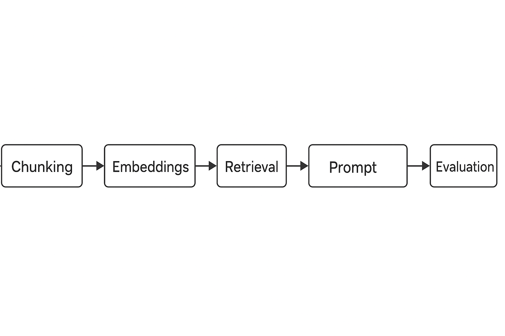

# RAG-Based Intelligent Query Assistant

This project demonstrates how a Retrieval-Augmented Generation (RAG) workflow can be used to answer user queries on document collections with better accuracy and lower hallucination rates.

It is designed from a Business Analyst + AI Analyst perspective, focusing on evaluation, prompt design, and information retrieval quality.

---

## 🎯 Problem Statement

Teams often need quick answers from long policies, knowledge bases, or documentation.  
Manually searching PDFs or Confluence pages is slow, and direct LLM calls can hallucinate or miss important clauses.

This project shows a simple RAG-style approach that:

- Breaks documents into chunks with metadata  
- Retrieves the most relevant chunks for a query  
- Uses an LLM with a guided prompt to generate the final answer  
- Evaluates responses for relevance and completeness

---

## 🧱 RAG Workflow

1. **Document Ingestion** – Load sample text / policy documents.
2. **Chunking & Metadata** – Split into overlapping chunks, tag with titles / sections.
3. **Vectorization & Retrieval** – Represent chunks as embeddings and retrieve top-k matches.
4. **Prompted Answer Generation** – Provide retrieved chunks + user query into the LLM.
5. **Evaluation** – Manually review responses for accuracy, coverage, and hallucinations.

*(You can run this conceptually via notebooks or external tools – this repo focuses on structure, prompts, and evaluation examples.)*

---

## 🧰 Tech / Concepts

- RAG (Retrieval-Augmented Generation)
- Chunking strategies (size, overlap)
- Embeddings / similarity search (conceptual)
- Prompt engineering for grounded answers
- Response evaluation and feedback

---

## 📂 Suggested Folder Structure

RAG-Intelligent-Query-Assistant/  
├─ README.md  
├─ data/  
│  ├─ sample_documents/  
│  │  ├─ policy_sample_1.txt  
│  │  ├─ faq_sample_1.txt  
├─ prompts/  
│  ├─ answer_prompt.txt  
│  ├─ evaluation_prompt.txt  
├─ outputs/  
│  ├─ sample_query_answers.md  
│  ├─ evaluation_notes.md  

---

## 📊 Example Business Value

- Faster lookup of answers from long documents  
- More consistent responses compared to manual search  
- Reduced hallucinations through retrieval + evaluation  
- Reusable approach for FAQs, policy queries, internal documentation, and support assistants
